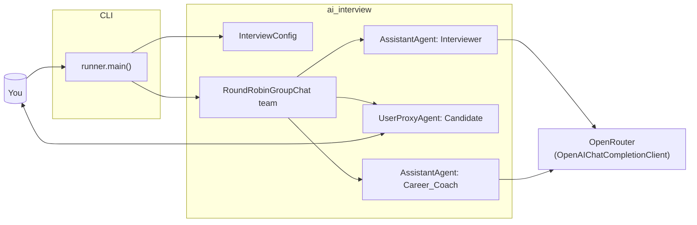

# AI Interviewer (Multi‑Agent CLI)

## Problem statement

Tech interviews are often unstructured, time‑consuming, and inconsistent between
interviewers. It is hard to:

- ask good, role‑specific questions every time
- give candidates fast feedback on how they performed

This project automates a small, focused interview loop so you can quickly
practice or prototype interview flows.

## What this app does

Small CLI app that runs a multi‑agent job interview in your terminal using
OpenRouter and `autogen_agentchat`.

- **Interviewer**: asks structured questions for a chosen role
- **Candidate**: your answers from the keyboard
- **Career coach**: gives feedback and a short summary at the end

---

## Architecture (LangGraph‑style view)

The core logic is split into a small `ai_interview` package:

- [`ai_interview/config.py`](file:///e:/projects/Gen%20AI/AI%20Interviewer/ai_interview/config.py) – `InterviewConfig` (job title, max turns, number of questions)
- [`ai_interview/model_client.py`](file:///e:/projects/Gen%20AI/AI%20Interviewer/ai_interview/model_client.py) – OpenRouter `OpenAIChatCompletionClient`
- [`ai_interview/agents.py`](file:///e:/projects/Gen%20AI/AI%20Interviewer/ai_interview/agents.py) – interviewer, candidate, career‑coach agents
- [`ai_interview/team.py`](file:///e:/projects/Gen%20AI/AI%20Interviewer/ai_interview/team.py) – `RoundRobinGroupChat` team wiring
- [`ai_interview/runner.py`](file:///e:/projects/Gen%20AI/AI%20Interviewer/ai_interview/runner.py) – async `run_interview` and CLI `main`
- [`AI_Interview.py`](file:///e:/projects/Gen%20AI/AI%20Interviewer/AI_Interview.py) – thin entrypoint that calls the runner

Simple graph of how things connect:

